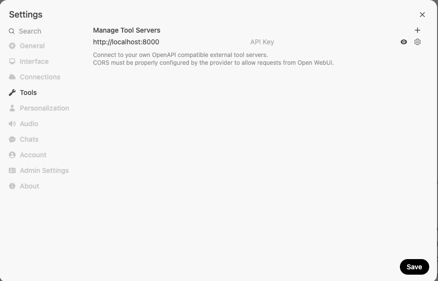

# DataGov MCP Server

## Overview
This repository contains the Model Control Protocol (MCP) server implementation for DataGov MY services.

## Prerequisites
- [Node.js](https://nodejs.org/) (v14.x or higher recommended)

## Getting Started

### Installation
Clone the repository and install dependencies:

```bash
git clone <repository-url>
cd datagov-mcp
npm install
```

### Development

Build and run the MCP server locally:

```bash
npm run build
node ./build/index.js
```

## Integration with OpenWebUI

### Setting Up the Proxy

**Step 1. Install the MCPO proxy utility:**
   ```bash
   pip install uv
   pip install mcpo
   ```

**Step 2. Launch the proxy server:**
   ```bash
   uvx mcpo --port 8000 -- node ./build/index.js
   ```

**Step 3. Configure OpenWebUI to connect to the MCP server:**
   - Navigate to Tools Settings in OpenWebUI
   - Add the MCP server configuration as shown below




